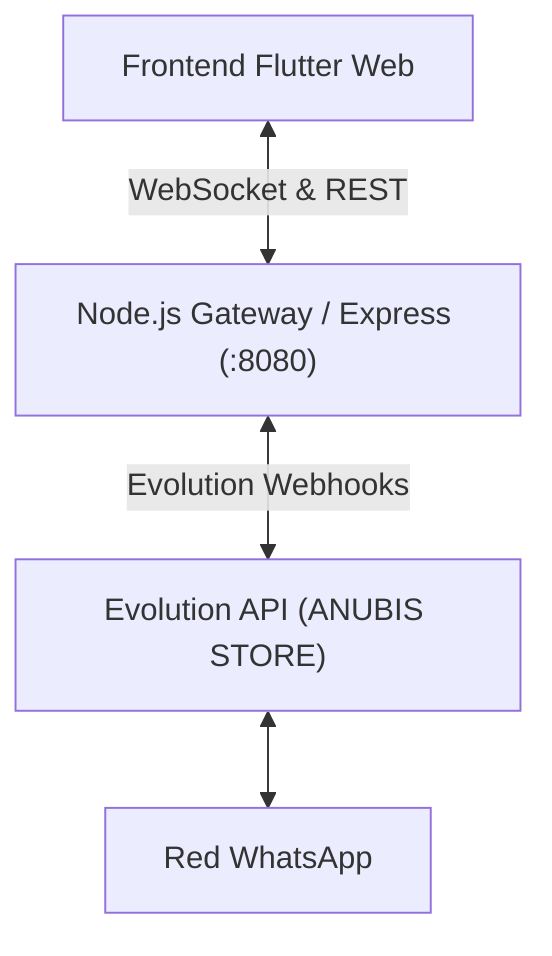

# Anubis WhatsApp Web (Flutter + Evolution API)

Clon limpio, moderno y minimalista de WhatsApp Desktop desarrollado en **Flutter Web** y conectado a **Evolution API** (`ANUBIS STORE`) a través de un Gateway en Node.js / TypeScript con WebSockets y soporte en tiempo real.

---

## Características Principales

- 🎨 **Interfaz WhatsApp Desktop Dark Oficial**:
  - Paleta exacta: `#0b141a` (fondo de conversación), `#111b21` (sidebar de chats), `#202c33` (burbuja entrante), `#005c4b` (burbuja saliente), `#00a884` (acento WhatsApp).
  - Divisor ajustable (**Resizable Splitter**): el usuario puede redimensionar con el ratón la barra lateral de chats a su gusto.
- ⚡ **Reflejo Optimista Instantáneo (<10ms)**:
  - Al presionar Enter, el mensaje aparece de inmediato en la pantalla sin esperar respuesta de red ni recargar la página.
- 🔄 **Sincronización en Tiempo Real (WebSocket)**:
  - Conexión persistente mediante WebSocket (`/ws`).
  - Recepción de mensajes entrantes (`MESSAGES_UPSERT`, `SEND_MESSAGE`).
  - Actualización de checks en vivo (`MESSAGES_UPDATE`):
    - 🕒 Reloj: pendiente
    - ✓ Gris: enviado al servidor
    - ✓✓ Gris: entregado al cliente
    - ✓✓ Azul: leído por el cliente
- 📸 **Fotos de Perfil y Avatares**:
  - Carga automática de la foto de perfil del contacto desde Evolution API (`profilePictureUrl`).
  - Fallback a iniciales sobre avatares circulares de color.
- 📂 **Soporte Multimedia**:
  - Envío y previsualización de imágenes, documentos y notas de audio.
- ⚡ **Respuestas Rápidas / Notas de Soporte**:
  - Panel lateral deslizante con respuestas predefinidas para agentes, organizadas por categoría e inserción inmediata con un solo clic.
- 📱 **Vinculación con Código QR**:
  - Modal integrado para escanear y vincular nuevas sesiones si WhatsApp se desvincula.

---

## Arquitectura

---

## Despliegue en Railway

El proyecto incluye un `Dockerfile` multi-etapa:
1. **Stage 1 (`flutter-builder`)**: Compila la aplicación Flutter Web con `flutter build web --release`.
2. **Stage 2 (`server-builder`)**: Compila el servidor TypeScript.
3. **Stage 3 (`runner`)**: Imagen ligera `node:20-alpine` que expone el puerto `8080`, sirve los estáticos compilados de Flutter y gestiona la API y WebSockets.

### Variables de Entorno en Railway:
- `PORT`: `8080`
- `EVOLUTION_API_URL`: URL de tu instancia de Evolution API (ej: `https://evolution-api-production-c04d.up.railway.app`)
- `EVOLUTION_API_KEY`: Clave API de Evolution
- `EVOLUTION_INSTANCE_NAME`: `ANUBIS STORE`
- `BACKEND_URL`: URL pública de este servicio en Railway (ej: `https://wsp-cmr-anubis-production.up.railway.app`)
